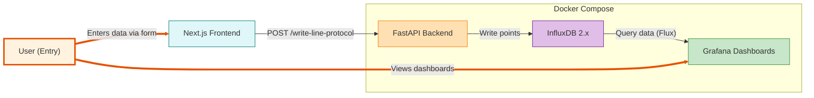

# Influx Data Entry

A simple full-stack proof-of-concept (POC) app for writing and visualizing time-series data in InfluxDB.

## Purpose
This app demonstrates how to:
- Accept InfluxDB line protocol entries via a modern web UI
- Store those entries in InfluxDB using a FastAPI backend
- Visualize the stored data using Grafana dashboards

## Stack
- **Frontend:** Next.js (with shadcn/ui, Tailwind CSS, zod, react-hook-form)
- **Backend:** FastAPI (Python)
- **Database:** InfluxDB 2.x
- **Visualization:** Grafana
- **Containerization:** Docker Compose

## Architecture


## Getting Started

### Prerequisites
- Docker & Docker Compose

### Start Everything (Production Containers)
```sh
docker-compose up --build
```
Services:
- Frontend: http://localhost:3000
- Backend:  http://localhost:8000
- InfluxDB: http://localhost:8086
- Grafana:  http://localhost:3001

## Testing
- Frontend UI (recommended): open http://localhost:3000 and submit examples:
  - `temp,loc=kr,room=e408 value=28`
  - `temp,loc=kr,room=e702 value=26`
  - `humidity,loc=kr value=0.56`
  - For strings, use a different field name to avoid type conflicts, e.g. `temp,loc=kr value_str="e408"`

- Direct backend test:
  ```sh
  curl -i -X POST http://localhost:8000/write-line-protocol \
    --data-binary 'temp,loc=kr value=28'
  ```

- Grafana:
  - Open http://localhost:3001 → use the InfluxDB datasource
  - Sample Flux query:
    ```
    from(bucket: "my-bucket")
      |> range(start: -15m)
      |> filter(fn: (r) => r._measurement == "temp" and r._field == "value")
    ```

## Project Structure
- `backend/` — FastAPI backend (production Dockerfile)
- `influx-data-entry/` — Next.js frontend (production, standalone Dockerfile)
- `docker-compose.yml` — Orchestrates all services

## Troubleshooting
- Invalid line protocol: remove spaces around commas; quote strings (e.g., `"e408"`).
- Field type conflict: don’t mix types for the same field; use separate fields like `value` (float) and `value_str` (string).
- InfluxDB UI unavailable: ensure port `8086` is free and the `influxdb` container is healthy (`docker-compose ps`, `docker-compose logs influxdb`).

## License
MIT
