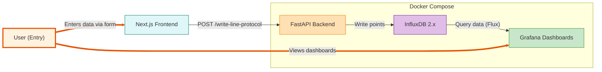

# Influx Data Entry

A simple full-stack proof-of-concept (POC) app for writing and visualizing time-series data in InfluxDB.

## Purpose
This app demonstrates how to:
- Accept InfluxDB line protocol entries via a modern web UI
- Store those entries in InfluxDB using a FastAPI backend
- Visualize the stored data using Grafana dashboards

## Stack
- **Frontend:** Next.js (with shadcn/ui, Tailwind CSS, zod, react-hook-form)
- **Backend:** FastAPI (Python)
- **Database:** InfluxDB 2.x
- **Visualization:** Grafana
- **Containerization:** Docker Compose → Kubernetes

## Architecture


## Project Structure
```
├── frontend/                 # Next.js frontend
│   ├── Dockerfile           # Production frontend image
│   ├── env.example          # Environment variables template
│   └── src/                 # Source code
├── api/                     # FastAPI backend
│   ├── Dockerfile           # Production API image
│   ├── env.example          # Environment variables template
│   └── main.py              # API source code
├── infra/                   # Infrastructure configs
│   ├── influxdb/
│   │   └── env.example      # InfluxDB environment template
│   └── grafana/
│       └── env.example      # Grafana environment template
├── k8s/                     # Kubernetes manifests
│   ├── base/                # Raw K8s YAML files
│   │   ├── frontend.yaml
│   │   ├── api.yaml
│   │   ├── influxdb.yaml
│   │   ├── grafana.yaml
│   │   └── ingress.yaml
│   └── helm/                # Helm chart (Phase 3)
│       ├── Chart.yaml
│       └── values.yaml
├── docker-compose.yml       # Multi-service orchestration
├── Makefile                 # Build and deployment commands
└── README.md               # This file
```

## Phase 0: Docker Compose (Current)

### Prerequisites
- Docker & Docker Compose

### Quick Start
1. **Clone and setup:**
   ```sh
   git clone https://github.com/pranavyey/influx-data-entry.git
   cd influx-data-entry
   ```

2. **Copy environment files:**
   ```sh
   cp frontend/env.example frontend/.env.local
   cp api/env.example api/.env.local
   cp infra/influxdb/env.example infra/influxdb/.env.local
   cp infra/grafana/env.example infra/grafana/.env.local
   ```

3. **Start everything:**
   ```sh
   make up
   # or: docker compose up -d
   ```

4. **Access services:**
   - Frontend: http://localhost:5173
   - API: http://localhost:8000
   - InfluxDB: http://localhost:8086
   - Grafana: http://localhost:3000

### Makefile Commands
```sh
make build      # Build all Docker images
make up         # Start all services
make down       # Stop and remove everything
make logs       # Follow logs from all services
make clean      # Remove all containers, volumes, and images
make status     # Show service status
```

### Testing
- **Frontend UI:** Open http://localhost:5173 and submit examples:
  - `temp,loc=kr,room=e408 value=28`
  - `humidity,loc=kr value=0.56`
  - For strings: `temp,loc=kr value_str="e408"`

- **Direct API test:**
  ```sh
  curl -i -X POST http://localhost:8000/write-line-protocol \
    --data-binary 'temp,loc=kr value=28'
  ```

- **Grafana:** Open http://localhost:3000 → use InfluxDB datasource

## Phase 1: Enhanced Docker (Future)
- [ ] Health checks and readiness probes
- [ ] Resource limits and monitoring
- [ ] Multi-stage builds optimization
- [ ] Security scanning and best practices

## Phase 2: Minikube Deployment (Future)
- [ ] Generate Kubernetes manifests from docker-compose
- [ ] Deploy to local Minikube cluster
- [ ] Configure persistent volumes and secrets
- [ ] Set up ingress for external access

```sh
# Future commands:
make minikube-start    # Start minikube and deploy
kubectl get pods       # Check deployment status
minikube service list  # Access services
```

## Phase 3: EKS Production (Future)
- [ ] Helm chart for easy deployment
- [ ] CI/CD pipeline with GitHub Actions
- [ ] Production-grade monitoring and logging
- [ ] Auto-scaling and high availability

```sh
# Future commands:
make k8s-deploy        # Deploy to EKS
helm install influx-data-entry ./k8s/helm
```

## Troubleshooting
- **Invalid line protocol:** Remove spaces around commas; quote strings (e.g., `"e408"`)
- **Field type conflict:** Don't mix types for the same field; use separate fields like `value` (float) and `value_str` (string)
- **Service unavailable:** Check `make status` and `make logs <service>`
- **Port conflicts:** Ensure ports 5173, 8000, 8086, 3000 are free

## License
MIT